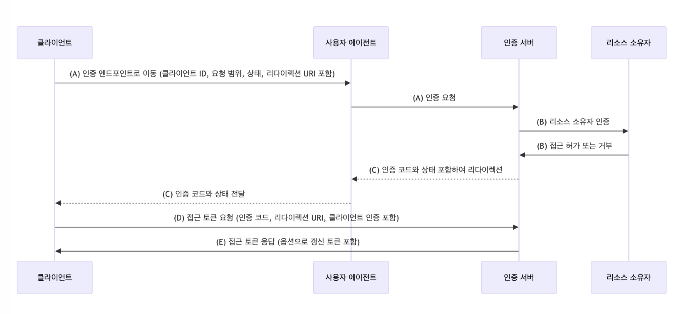
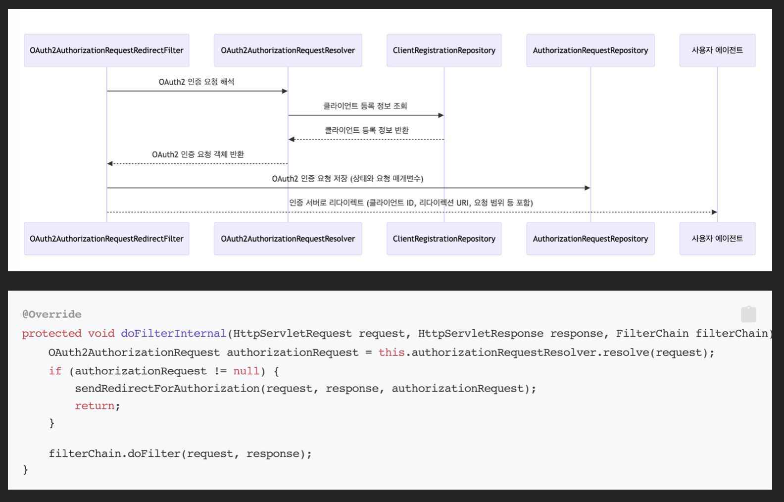
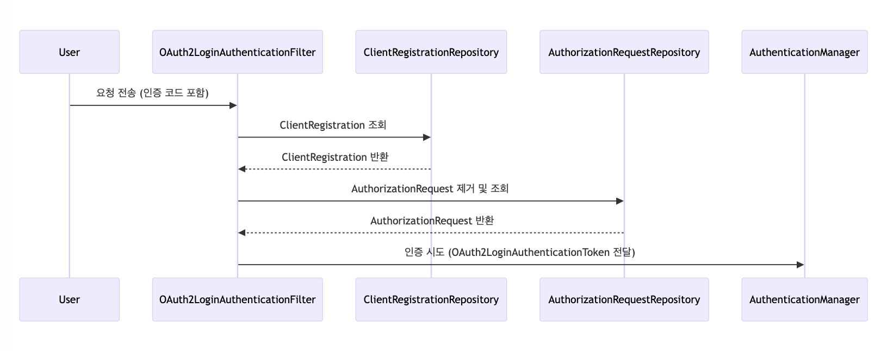
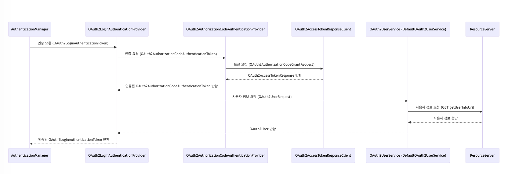
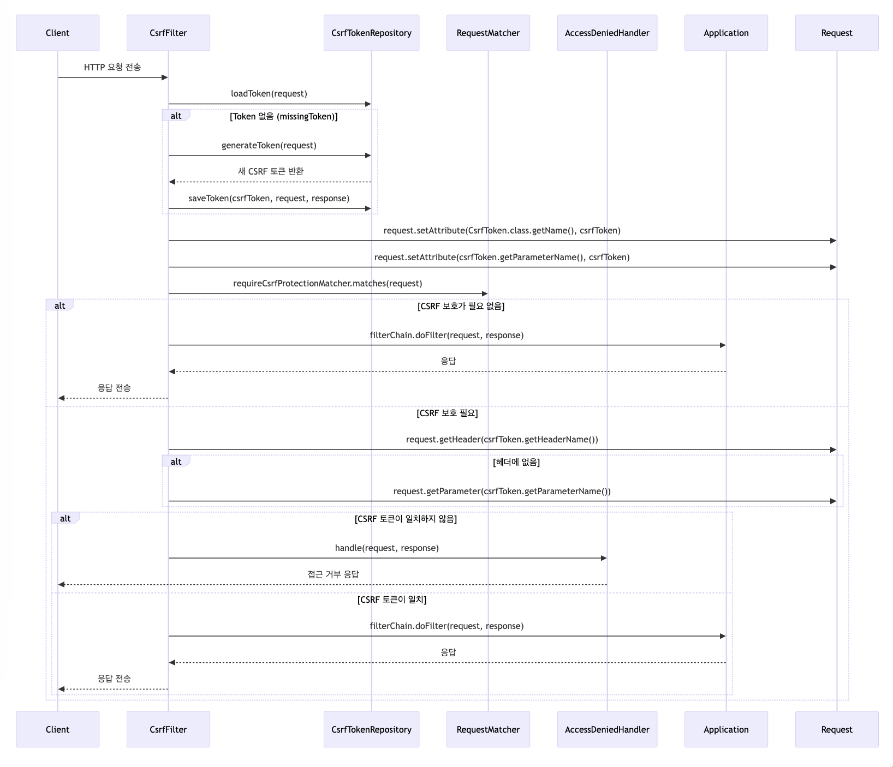

# day3

# 1단계 - OAuth 2.0 Login

## 목적
- OAuth2 인증 방식을 이해하고, 이를 기반으로 Github 계정을 사용한 인증 및 인가를 구현할 수 있다.
- Github을 통해 사용자의 인증을 처리하고, 필요한 권한을 얻어 사용자 정보를 안전하게 가져오는 경험을 쌓는다.

## 요구사항
Github을 통한 로그인을 구현한다. 전체 과정을 수행하기 위해 아래 순서로 구현한다.

### 1. Github Application 등록
Github 계정을 통한 인증을 구현하려면 우선 Github에서 OAuth App을 생성해야 한다. 다음 절차에 따라 Github에서 OAuth App을 등록하고 필요한 정보를 얻는다.

- [Github 가이드 문서](https://docs.github.com/en/developers/apps/building-oauth-apps/creating-an-oauth-app)를 참고해 OAuth Application을 생성한다.
    - Homepage URL: http://localhost:8080
    - Authorization callback URL: http://localhost:8080/login/oauth2/code/github
    - Client ID와 Client Secret을 기록해둔다.

### 2. 인증 URL 리다이렉트 필터 구현
깃헙 로그인을 위해 깃헙 로그인 버튼을 누르면 깃헙 로그인 페이지로 이동해야한다. 이를 위해, 깃헙 로그인 페이지로 리다이렉트를 시키는 기능을 구현해야 한다.

- `GET /oauth2/authorization/github` 요청 시 Github의 인증 URL로 리다이렉트시키는 필터를 구현한다.
- [Github의 인증 URL은 Github 가이드 문서](https://docs.github.com/en/apps/oauth-apps/building-oauth-apps/authorizing-oauth-apps#1-request-a-users-github-identity)와 다음의 예시를 참고하여 만든다.

```
https://github.com/login/oauth/authorize?response_type=code&client_id=클라이언트_ID&scope=read:user&redirect_uri=http://localhost:8080/login/oauth2/code/github
```

### 3. Github Access Token 획득
리다이렉트된 URL로 이동하여 사용자가 Github 로그인을 마치면 승인 코드가 전달된다. 이 코드를 사용해 Github Access Token을 얻어야 한다.

- `GET /login/oauth2/code/github` 요청 시 승인 코드를 받아 Access Token을 요청하는 필터를 작성한다.
- Access Token 요청은 다음과 같이 구성된다.
    - `POST https://github.com/login/oauth/access_token`
    - [필요한 파라미터는 Github 가이드 문서](https://docs.github.com/en/apps/oauth-apps/building-oauth-apps/authorizing-oauth-apps#2-users-are-redirected-back-to-your-site-by-github)를 참고한다.

### 4. OAuth2 사용자 정보 조회
Access Token을 획득한 후에는 Github API를 통해 사용자 정보를 가져와야 한다.

- `GET https://api.github.com/user` 요청을 통해 사용자 정보를 가져오는 로직을 작성한다.
- [Access Token을 사용해 Github API에 인증된 요청을 보낸다. 자세한 내용은 Github 가이드 문서](https://docs.github.com/en/apps/oauth-apps/building-oauth-apps/authorizing-oauth-apps#3-use-the-access-token-to-access-the-api)를 참고한다.

### 5. 후처리
- 이후 프로필 정보를 가지고 회원 가입 & 로그인을 구현한다.
- 기존 멤버 정보가 있는 경우 세션에 로그인 정보를 저장한 뒤 "/"으로 리다이렉트
- 새로운 멤버인 경우 회원 가입 후 세션에 로그인 정보를 저장한 뒤 "/"으로 리다이렉트

## 힌트
### OAuth 2.0의 Authorization Code Grant 타입 흐름


### 리다이렉트 기능 테스트
```java
@SpringBootTest
@AutoConfigureMockMvc
class GithubLoginRedirectFilterTest {

    @Autowired
    private MockMvc mockMvc;

    @Test
    void redirectTest() throws Exception {
        String requestUri = "/oauth2/authorization/github";
        String expectedRedirectUri = "https://github.com/login/oauth/authorize" +
                "?client_id=Ov23liTBhugSIcf8VX1v" +
                "&response_type=code" +
                "&scope=read:user" +
                "&redirect_uri=http://localhost:8080/login/oauth2/code/github";

        mockMvc.perform(MockMvcRequestBuilders.get(requestUri))
                .andExpect(MockMvcResultMatchers.status().is3xxRedirection())
                .andExpect(MockMvcResultMatchers.redirectedUrl(expectedRedirectUri));
    }
}
```

### 인증 기능 테스트
```java
package nextstep.app;

import com.fasterxml.jackson.databind.ObjectMapper;
import com.github.tomakehurst.wiremock.WireMockServer;
import com.github.tomakehurst.wiremock.core.WireMockConfiguration;
import org.junit.jupiter.api.BeforeEach;
import org.junit.jupiter.api.Test;
import org.springframework.beans.factory.annotation.Autowired;
import org.springframework.boot.test.autoconfigure.web.servlet.AutoConfigureMockMvc;
import org.springframework.boot.test.context.SpringBootTest;
import org.springframework.http.HttpHeaders;
import org.springframework.test.web.servlet.MockMvc;
import org.springframework.test.web.servlet.request.MockMvcRequestBuilders;
import org.springframework.test.web.servlet.result.MockMvcResultMatchers;

import java.util.HashMap;
import java.util.Map;

import static com.github.tomakehurst.wiremock.client.WireMock.*;

@SpringBootTest
@AutoConfigureMockMvc
@AutoConfigureWireMock(port = 8089)
class GithubAuthenticationFilterTest {

    @Autowired
    private MockMvc mockMvc;

    private WireMockServer wireMockServer;

    @BeforeEach
    void setupMockServer() throws Exception {
        Map<String, String> responseBody = new HashMap<>();
        responseBody.put("access_token", "mock_access_token");
        responseBody.put("token_type", "bearer");
        String jsonResponse = new ObjectMapper().writeValueAsString(responseBody);

        stubFor(post(urlEqualTo("/login/oauth/access_token"))
                .willReturn(aResponse()
                        .withHeader(HttpHeaders.CONTENT_TYPE, "application/json")
                        .withBody(jsonResponse)));
    }

    @Test
    void redirectAndReqeustGithubAccessToken() throws Exception {
        String requestUri = "/login/oauth2/code/github?code=mock_code";


        mockMvc.perform(MockMvcRequestBuilders.get(requestUri))
                .andExpect(MockMvcResultMatchers.status().isOk()) // 기능 확인을 위한 200 응답 확인
                .andExpect(MockMvcResultMatchers.content().string("mock_access_token")); // 기능 확인을 위한 응답값 확인
    }
}
```

# 2단계 - 리팩터링 & OAuth 2.0 Resource 연동

## 목적
- Google 계정을 사용한 인증 및 인가를 추가한다.
- 기존 Github 인증과 중복된 코드를 제거한다.
- 인증된 사용자를 Member로 관리하는 기능을 구현한다.
- 로그인한 사용자가 Member 리소스에 접근할 수 있도록 설정한다.

## 요구사항
### 1. Google 계정을 사용한 인증, 인가
Google 계정을 사용해 OAuth2 인증을 구현한다. 이는 1단계에서 구현한 Github 인증과 유사한 방식으로 진행된다.

- Google OAuth 2.0 가이드 문서를 참고해 OAuth Application을 등록하고 Client ID, Client Secret을 얻는다.
    - 승인된 자바스크립트 원본: http://localhost:8080
    - 승인된 리디렉션 URI: http://localhost:8080/login/oauth2/code/google
- 1단계와 동일한 흐름으로 Google 로그인을 구현한다.
    - [Google OAuth 2.0 Authorization 요청 가이드](https://developers.google.com/identity/protocols/oauth2/native-app#step-2:-send-a-request-to-googles-oauth-2.0-server)를 참고해 인증 요청을 보낸다.
    - Scope:
  ```
  https://www.googleapis.com/auth/userinfo.profile+https://www.googleapis.com/auth/userinfo.email
  ```
    - [Google OAuth 2.0 Access Token 요청 가이드](https://developers.google.com/identity/protocols/oauth2/native-app#exchange-authorization-code)를 참고해 Access Token을 받는다.
    - 사용자 정보 조회:
  ```
  Authorization: Bearer OAUTH-TOKEN  GET https://www.googleapis.com/oauth2/v2/userinfo
  ```

### 2. 리팩터링
Google 인증을 추가하면서 발생한 중복된 코드를 제거하고, 코드 구조를 개선한다.

- Github과 Google 인증 로직 간의 중복된 코드를 제거하고, 프레임워크의 인증 로직과 애플리케이션의 비즈니스 로직을 분리한다.
- Github과 Google의 정보를 properties(혹은 yaml)파일로 분리한다.
    - 아래 두 애너테이션을 활용하면 편리하게 관리할 수 있다.
        - `@EnableConfigurationProperties`, `@ConfigurationProperties`

## 힌트
### Properties 주입
#### @Value
```properties
client.object.name=name
```

```java
@Value("${client.object.name}")
private String name;
```

#### @ConfigurationProperties - 객체 주입
```properties
client.object.id=1
client.object.name=name
client.object.email=email@email.com
```
```java
@Component
@ConfigurationProperties(prefix = "client.object")
public class ObjectProperties {
private int id;
private String name;
private String email;

    // getter and setter
    ...

}
```

#### @ConfigurationProperties - Map 주입
```properties
client.map.first.id=1
client.map.first.name=first
client.map.first.email=first@email.com
client.map.second.id=2
client.map.second.name=second
client.map.second.email=second@email.com
```

```java
@Component
@ConfigurationProperties(prefix = "client")
public class MapProperties {

    Map<String, ObjectProperties> map;

    public Map<String, ObjectProperties> getMap() {
        return map;
    }

    public void setMap(Map<String, ObjectProperties> map) {
        this.map = map;
    }
}
```

#### 참고 문서
https://docs.spring.io/spring-boot/reference/features/external-config.html

# 3단계 - 스프링 시큐리티 구조 적용
## 목적
OAuth2 인증 및 인가 로직을 스프링 시큐리티 구조처럼 리팩터링하는 것이 목표이다. `spring-boot-starter-oauth2-client`에서 제공하는 기능들을 활용해 서드파티 인증 제공자(Github, Google 등)를 효율적으로 관리하고, 인증된 사용자의 정보를 일관되게 처리하는 구조를 만드는 것이 핵심이다.

## 요구사항
### OAuth2AuthorizationRequestRedirectFilter
OAuth2 인증 요청을 리다이렉트하는 필터인 `OAuth2AuthorizationRequestRedirectFilter`를 구현한다. 이 필터는 사용자가 OAuth2 제공자(Google, Github)로 인증 요청을 보낼 때 사용된다.

#### 진행 방법
- `doFilterInternal` 메서드 내용을 파악하고 전체적인 흐름을 이해한다.
- try-catch 문에서 try에 먼저 집중하고 모두 구현이 끝난 후 catch 부분을 참고한다.
- authorizationRequestResolver과 authorizationRequestRepository의 역할에 대해 이해한다.
- 다음 코드는 doFilterInternal의 핵심이 되는 코드이다.

```java
@Override
protected void doFilterInternal(HttpServletRequest request, HttpServletResponse response, FilterChain filterChain) throws ServletException, IOException {
    OAuth2AuthorizationRequest authorizationRequest = this.authorizationRequestResolver.resolve(request);
    if (authorizationRequest != null) {
        sendRedirectForAuthorization(request, response, authorizationRequest);
        return;
    }

    filterChain.doFilter(request, response);
}
```

#### 주요 클래스
- OAuth2AuthorizationRequestResolver
- AuthorizationRequestRepository
- OAuth2AuthorizationRequest
- ClientRegistrationRepository

### ClientRegistrationRepository
다양한 OAuth2 제공자(Google, Github 등)에 대한 클라이언트 등록 정보를 관리하고, 필요에 따라 확장 가능한 저장소를 구현한다.

#### 진행 방법
- ClientRegistrationRepository 코드를 참고하고 구현체인 InMemoryClientRegistrationRepository를 확인한다
    - 다른 구현체를 사용하지 않을 계획이라면 ClientRegistrationRepository에 InMemoryClientRegistrationRepository를 구현해도 무방하다.
- ClientRegistration 코드를 참고하여 구현한다.
    - ProviderDetails과 UserInfoEndpoint가 내부 클래스로 존재한다.
    - 이들의 쓰임이 이해가 되지 않는다면 없이 먼저 구현한다.
    - 그 다음 필요성이 느껴지거나 이해가 된다면 그 때 내부 클래스로 구현해서 사용한다.
    - 필요성이 느껴지지 않으면 구현하지 않아도 무방하다.(필요성이 느껴지지 않은 상황에서 구현할 경우 더 혼동이 올 가능성이 높음)
- ClientRegistrationRepository 빈 등록을 한다.
    - SecurityConfig에서 빈 등록을 할 때 앞서 만들어 둔 OAuth2ClientProperties를 활용한다.

#### 주요 클래스
- CustomClientRegistrationRepository
- ClientRegistration
- OAuth2ClientProperties

### OAuth2UserService
OAuth2UserService를 구현하여 OAuth2 제공자로부터 받은 사용자 정보를 기반으로 애플리케이션 내 사용자 객체를 생성하거나 업데이트한다. 

#### 진행 방법
- UserDetailsService와 UserDetails를 떠올리면 이해하기 수월하다.
- OAuth2UserService의 구현체를 클래스로 만들어주어도 좋고, SecurityConfig에서 추상 클래스로 직접 구현해주어도 좋다. (OAuth2User도 마찬가지)
- OAuth2LoginAuthenticationFilter에서 MemberRepository를 직접 사용하고 있다면 OAuth2UserService로 대체한다.

#### 주요 클래스
- OAuth2UserService
- OAuth2User

### OAuth2LoginAuthenticationFilter
OAuth2LoginAuthenticationFilter를 구현하여 OAuth2 인증 제공자로부터의 응답을 처리하고, 사용자 인증을 완료한다. ~~상당히 복잡할 수 있으므로 집중을 한다 😳~~

#### 진행 방법
- doFilter를 기준으로 전체적인 큰 흐름을 잡는다. AbstractAuthenticationProcessingFilter 구조로 추상화해두지 않았다면 아래와 같이 흐름을 먼저 잡고 진행해도 좋다.
```java
private void doFilter(HttpServletRequest request, HttpServletResponse response, FilterChain chain) throws IOException, ServletException {
    if (!requiresAuthentication(request, response)) {
        chain.doFilter(request, response);
        return;
    }
    try {
        Authentication authenticationResult = attemptAuthentication(request, response);
        if (authenticationResult == null) {
            return;
        }
        successfulAuthentication(request, response, chain, authenticationResult);
    } catch (AuthenticationException ex) {
        SecurityContextHolder.clearContext();
    }
}
```
- attemptAuthentication 메서드는 상당히 긴 메서드이므로 아래와 같은 흐름을 잡고 진행하는 것을 추천한다.
```java
private Authentication attemptAuthentication(HttpServletRequest request, HttpServletResponse response) {

    // request에서 parameter를 가져오기

    // session에서 authorizationRequest를 가져오기

    // registrationId를 가져오고 clientRegistration을 가져오기

    // code를 포함한 authorization response를 객체로 가져오기

    // access token 을 가져오기 위한 request 객체 만들기

    // OAuth2LoginAuthenticationToken 만들기

    // provider 인증 후 authenticated된 OAuth2AuthenticationToken 객체 가져오기

    // authorizedClientRepository 에 저장할 OAuth2AuthorizedClient을 만들고 저장

    return oauth2Authentication;
}
```

#### 주요 클래스
- ClientRegistrationRepository
- OAuth2AuthorizedClientRepository
- AuthorizationRequestRepository
- AuthenticationManager
- HttpSessionSecurityContextRepository
- Converter와 Converter<OAuth2LoginAuthenticationToken, OAuth2AuthenticationToken>
```java
private Converter<OAuth2LoginAuthenticationToken, OAuth2AuthenticationToken> authenticationResultConverter = this::createAuthenticationResult;
```

## 힌트
### OAuth2AuthorizationRequestRedirectFilter
- 리다이렉트의 시퀀스 다이어그램과 뼈대가 되는 핵심 로직


### OAuth2LoginAuthenticationFilter
- 인증 필터 시퀀스 다이어그램


### OAuth2LoginAuthenticationProvider와 OAuth2AuthorizationCodeAuthenticationProvider 


### Converter
```java
private Converter<OAuth2LoginAuthenticationToken, OAuth2AuthenticationToken> authenticationResultConverter = new Converter<OAuth2LoginAuthenticationToken, OAuth2AuthenticationToken>() {
    @Override
    public OAuth2AuthenticationToken convert(OAuth2LoginAuthenticationToken authenticationResult) {
        return OAuth2LoginAuthenticationFilter.this.createAuthenticationResult(authenticationResult);
    }
};

private OAuth2AuthenticationToken createAuthenticationResult(OAuth2LoginAuthenticationToken authenticationResult) {
    return new OAuth2AuthenticationToken(authenticationResult.getPrincipal(), authenticationResult.getAuthorities());
}
```
- 아래와 같이 축약이 가능하다.
```java
private Converter<OAuth2LoginAuthenticationToken, OAuth2AuthenticationToken> authenticationResultConverter = this::createAuthenticationResult;
```


# day4

# 1단계 - CSRF Filter 구현
## 목표
CSRF (Cross-Site Request Forgery) 공격을 방지하기 위해 CSRF 필터를 직접 구현하고, 필터가 정상적으로 동작하는지를 검증한다. 이 과제는 CSRF 토큰의 발급, 저장, 검증을 다루며, `CsrfTest.java` 테스트를 성공적으로 통과하면 구현이 완료된 것으로 간주된다.

## 요구사항
### 1. CsrfTokenRepository 구현
- CSRF 토큰을 생성하고, HTTP 세션에 저장하며, 요청 시 토큰을 불러오는 역할을 담당한다.
- 메서드 구현:
  - `saveToken(CsrfToken token, HttpServletRequest request, HttpServletResponse response)`: 요청과 세션에 CSRF 토큰을 저장한다.
  - `loadToken(HttpServletRequest request)`: 세션에서 CSRF 토큰을 불러온다.
  - `generateToken(HttpServletRequest request)`: 새로운 CSRF 토큰을 생성한다.
### 2. CsrfFilter 구현
- 클라이언트가 제공한 CSRF 토큰을 요청 헤더 또는 파라미터에서 추출하고, 세션에 저장된 토큰과 비교하여 검증한다.
- GET, HEAD, TRACE, OPTIONS와 같은 메서드는 기본적으로 검증 대상에서 제외된다.
- 검증에 실패한 경우 `AccessDeniedHandler`를 호출하여 접근을 차단한다.
### 3. AccessDeniedHandler 구현
- CSRF 검증 실패 시 접근을 거부하고 403 Forbidden 응답을 반환한다.

### 4. CsrfToken 관리
- CSRF 토큰에 대한 정보를 관리하며, 요청 헤더 이름, 파라미터 이름, 실제 토큰 값을 포함한다.

### 참고
코드를 참고할 때 최신 버전의 필터 대신 Spring Security 5.7 버전의 CSRF 필터를 참고. [Spring Security 5.7 CSRF Filter 코드 보기](https://github.com/spring-projects/spring-security/blob/5.7.x/web/src/main/java/org/springframework/security/web/csrf/CsrfFilter.java)

## 힌트
### CSRF 흐름 설명



# 2단계 - HttpSecurity 리팩터링
## 목표
기존에 `SecurityFilterChain`과 필터 리스트를 명시적으로 구성하던 방식을 `HttpSecurity`와 스프링 시큐리티의 다양한 설정자(Configurer)를 활용하여 리팩터링한다. 각 단계별로 필터를 리팩터링하고, 스프링 부트의 Auto Configuration을 통해 기본 보안 설정을 활성화할 수 있도록 리팩터링하는 것을 목표로 한다.

## 요구사항 
### 기본적인 `SecurityFilterChain` 생성 및 리팩터링
#### 설명 
기존 코드에서 직접 필터를 명시적으로 리스트에 추가하던 방식을 `HttpSecurity`를 활용하여 설정하는 방식으로 리팩터링한다. 보안 컨텍스트와 예외 처리를 포함한 기본 보안 체인을 구성한다. 이 때 한번에 코드를 옮기기 보다는 하나씩 만들어가는 것을 권장한다. 작업의 흐름은 아래 커밋 목록을 참고해도 좋다.
https://github.com/whwha/spring-security-oauth2/commits/config-sample

#### 작업 흐름
- 먼저 SecurityFilterChain 빈을 생성하는 빈 뼈대 메서드와 HttpSecurity의 뼈대 코드를 만든다.
```java
@Bean
public SecurityFilterChain securityFilterChain(HttpSecurity http) {
    return http
            .build();
}
```
```java
public class HttpSecurity {
    private final LinkedHashMap<Class<? extends SecurityConfigurer>, SecurityConfigurer> configurers = new LinkedHashMap<>();
    private List<Filter> filters = new ArrayList<>();

    public SecurityFilterChain build() {
        init();
        configure();
        return new DefaultSecurityFilterChain(filters);
    }

    private void init() {
        for (SecurityConfigurer configurer : this.configurers.values()) {
            configurer.init(this);
        }
    }

    private void configure() {
        for (SecurityConfigurer configurer : this.configurers.values()) {
            configurer.configure(this);
        }
    }

    ...
    
    private SecurityConfigurer getOrApply(SecurityConfigurer configurer) {
        Class<? extends SecurityConfigurer> clazz = configurer.getClass();
        SecurityConfigurer existingConfig = this.configurers.get(clazz);
        if (existingConfig != null) {
            return existingConfig;
        }
        this.configurers.put(clazz, configurer);
        return configurer;
    }

}
```
- 이어서 필터 설정에 필요한 메서드를 하나씩 추가하면서 구현한다.
```java
    public HttpSecurity csrf() {
        return HttpSecurity.this;
    }
```
- Customizer와 SecurityConfigurer 구조를 참고해서 내부 구현을 진행한다.
```java
public HttpSecurity csrf(Customizer<CsrfConfigurer> csrfCustomizer) {
    csrfCustomizer.customize(getOrApply(new CsrfConfigurer()));
    return HttpSecurity.this;
}
```

### 인증 관련 리팩터링
#### 설명
기존에 직접 추가하던 `UsernamePasswordAuthenticationFilter`와 `BasicAuthenticationFilter`를 `HttpSecurity`의 `.formLogin()`과 `.httpBasic()` 메서드를 사용해 설정하는 방식으로 리팩터링한다.

#### 작업
1. `.formLogin()` 메서드를 사용하여 폼 로그인 기능을 설정하고, `UsernamePasswordAuthenticationFilter`를 자동으로 추가한다.
2. `.httpBasic()` 메서드를 사용해 HTTP Basic 인증을 설정하고, `BasicAuthenticationFilter`를 자동으로 추가한다. 

### 인가 관련 리팩터링
#### 설명
기존에 직접 추가하던 `AuthorizationFilter`를 `HttpSecurity`의 `.authorizeHttpRequests()` 설정을 통해 대체하고, 접근 권한 설정을 커스터마이징한다.

#### 작업
`.authorizeHttpRequests()` 메서드를 사용해 특정 경로에 대해 권한 없이 접근 가능하도록 설정하고, 나머지 요청에 대해서는 인증이 필요하도록 설정한다.

#### 예시코드
```java
@Bean
public SecurityFilterChain securityFilterChain(HttpSecurity http) throws Exception {
    http
        .authorizeHttpRequests(authorize -> authorize
            .requestMatchers("/public").permitAll()  // /public 경로는 모두 허용
            .anyRequest().authenticated())  // 그 외의 경로는 인증 필요
        .formLogin(Customizer.withDefaults())  // 폼 로그인
        .httpBasic(Customizer.withDefaults());  // HTTP Basic 인증
    return http.build();
}
```

### Auto Configuration을 통한 기본 `SecurityFilterChain` 설정
#### 설명
스프링 부트의 자동 설정을 통해 기본 `SecurityFilterChain`이 설정되도록 하고, 필요시 사용자가 새로운 `SecurityFilterChain`을 추가할 수 있도록 한다. 사용자가 새로운 `SecurityFilterChain`을 정의할 경우, 기본 보안 설정이 비활성화된다.

#### 작업
스프링 부트의 Auto Configuration을 통해 기본적인 보안 설정을 자동으로 적용하도록 설정한다.
사용자가 새로운 `SecurityFilterChain`을 정의할 경우, 기본 설정이 비활성화되도록 조건부 설정을 추가한다.


## 힌트
### 1. `HttpSecurity`의 Builder 패턴 활용
- Builder 패턴의 동작 방식: `HttpSecurity`는 Builder 패턴을 사용하여 보안 설정을 체계적으로 적용한다. 각 설정 메서드는 설정을 변경한 후 `HttpSecurity` 객체를 반환하며, 체이닝 방식으로 설정을 이어갈 수 있다. 예를 들어, 여러 설정을 한 번에 적용하고 최종적으로 `build()`를 호출하여 필터 체인을 생성할 수 있다.
```java
@Bean
public SecurityFilterChain securityFilterChain(HttpSecurity http) throws Exception {
    http
        .authorizeHttpRequests(authorize -> authorize.anyRequest().authenticated())
        .formLogin(formLogin -> formLogin.loginPage("/login").permitAll())
        .httpBasic(Customizer.withDefaults());
    return http.build();  // 최종적으로 build() 호출하여 필터 체인 생성
}
```

### 2. `XXConfigurer`의 구조와 동작 원리
`HttpSecurity`에서 사용되는 각종 설정 메서드들은 내부적으로 `Configurer` 클래스를 통해 동작한다. `Configurer`는 스프링 시큐리티에서 **특정 기능을 설정하는 모듈**을 의미하며, 필터를 추가하거나 설정을 구성하는 역할을 한다.

#### `XXConfigurer`의 구조
1. `init()`: 설정의 초기화 단계에서 동작하며, 보안 설정이 적용되기 전 기본 설정을 준비한다. 주로 필터가 필요할 때 이를 추가하는 역할을 한다.
2. `configure()`: 설정의 실제 적용 단계에서 동작하며, 보안 설정이 최종적으로 적용되고 필터 체인이 완성된다. 요청이 처리될 때 적용된다.

#### `XXConfigurer`의 동작 예시 (`FormLoginConfigurer`)
```java
@Override
public void init(HttpSecurity http) throws Exception {
    UsernamePasswordAuthenticationFilter authenticationFilter = new UsernamePasswordAuthenticationFilter();
    http.addFilterBefore(authenticationFilter, BasicAuthenticationFilter.class);
}

@Override
public void configure(HttpSecurity http) throws Exception {
    http.formLogin()
        .loginPage("/custom-login")
        .permitAll();  // 커스텀 로그인 페이지 설정
}
```

### 3. 인증과 인가 구분
스프링 시큐리티의 보안 설정에서 **인증(Authentication)** 과 **인가(Authorization)** 는 각각 다른 역할을 수행한다.

- **인증**: 사용자의 신원을 확인하는 단계로, 주로 `UsernamePasswordAuthenticationFilter`와 같은 필터가 사용된다. `formLogin()`이나 `httpBasic()`을 통해 설정한다.
- **인가**: 사용자의 권한을 확인하는 단계로, 특정 리소스에 접근할 수 있는지 검사한다. `authorizeHttpRequests()` 메서드를 통해 설정하며, 요청별로 권한을 다르게 설정할 수 있다.

#### 인증 설정 예시
```java
http
    .formLogin(formLogin -> formLogin.loginPage("/login").permitAll())  // 폼 로그인 설정
    .httpBasic(Customizer.withDefaults());  // HTTP Basic 인증 설정
```

#### 인가 설정 예시
```java
http
    .authorizeHttpRequests(authorize -> authorize
        .requestMatchers("/admin/**").hasRole("ADMIN")  // 관리자만 접근 가능
        .anyRequest().authenticated());  // 그 외의 요청은 인증 필요
```

### 4. Auto Configuration 사용
스프링 부트는 `SecurityAutoConfiguration`을 통해 기본 보안 설정을 제공한다. 이는 애플리케이션이 실행될 때 자동으로 `SecurityFilterChain`을 설정하며, 특정 조건에서 자동으로 활성화된다.

- `@ConditionalOnDefaultWebSecurity`: 스프링 부트의 기본 보안 설정이 활성화되도록 하는 조건부 애노테이션이다. 사용자가 명시적으로 보안 설정을 정의하지 않은 경우에만 기본 보안 설정을 적용한다.
- `@ConditionalOnMissingBean`: 사용자가 직접 보안 설정을 정의할 경우, 기본 보안 설정이 비활성화되도록 한다. 이를 통해 새로운 `SecurityFilterChain`을 정의하면 기본 설정을 대체할 수 있다.

```java
@Configuration(proxyBeanMethods = false)
@ConditionalOnDefaultWebSecurity
public class DefaultSecurityConfig {

    @Bean
    @Order(SecurityProperties.BASIC_AUTH_ORDER)
    SecurityFilterChain defaultSecurityFilterChain(HttpSecurity http) throws Exception {
        http
            .authorizeHttpRequests(authorize -> authorize.anyRequest().authenticated())
            .formLogin(Customizer.withDefaults())
            .httpBasic(Customizer.withDefaults());
        return http.build();
    }
}
```


